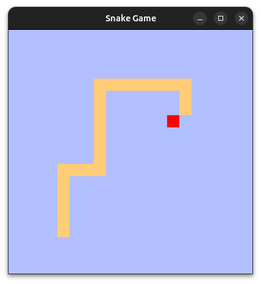

# Змейка 0.1.0 

## Преамбула
Решил "потыкать" Rust, нейросеть предложила несколько проектов на выбор среди них была "Змейка". Так и родился этот репозиторий. 
В моем распоряжении есть Mac M4, стационар и лаптоп на Intel под Ubuntu.
На Маке не собирается, жалуется на либу "cocoa", хотя в проекте она не используется, думаю в зависимостях либы "piston".

## Описание
Классическая игра "Змейка", помню ее со времен тетриса (тот что портативная консоль).
Управление клавишами: ⬅️➡️⬆️⬇️, и клавиша 'Esc' для выхода из игры. 
Если "Змейка" врежется сама в себя, игра начнется заново, если змейка выйдет за пределы одной из сторон поля, тело появится с противоположной стороны. 

