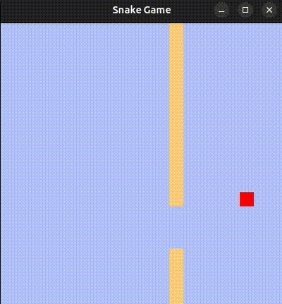

`# 🐍 Snake Game in Rust



## About
I decided to try Rust, and the neural network suggested a few project ideas — among them was the classic "Snake" game.  
This repository is the result of that experiment.

Tested on Ubuntu under X11.  
If you are using Wayland, run with:
```bash
WINIT_UNIX_BACKEND=x11 cargo run
```

## Description
Classic "Snake" game that I remember from the old handheld Tetris consoles.
* Control with the arrow keys ⬅️➡️⬆️⬇️. Press 'Esc' to exit the game.
* If the snake runs into itself, the game restarts.
* If the snake goes beyond one side of the field, it reappears on the opposite side.

## ⚙️ Build & Run
```bash
cargo run
```

## ✅ Features
* Classic gameplay
* Snake wraps around the screen edges
* Automatic restart on collision
* Simple and clean code structure

## 📦 Dependencies
* piston = "0.36.0"
* piston2d-graphics = "0.26.0"
* pistoncore-glutin_window = "0.45.0"
* piston2d-opengl_graphics = "0.52.0"
* rand = "0.9.1"